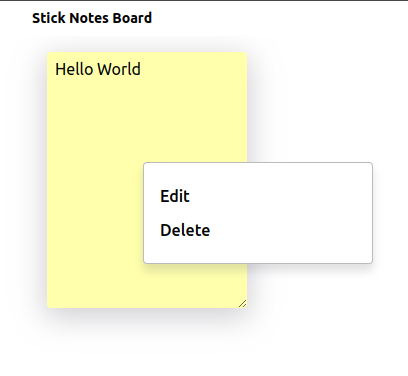

# Stick Notes Board

A basic and lightweight stick notes board in your browser.

- Can you add multiple notes and resize them super quickly.
- Can you drag your notes easily.
- Can you edit and delete your notes in two clicks.
- Dont miss your work: All your notes is saved in your browser.



---

## How to run locally

How to start frontend in dev mode:
```bash
yarn dev
```

How to build:
```bash
yarn build
```

How to start in preview mode:
```bash
yarn preview
```
